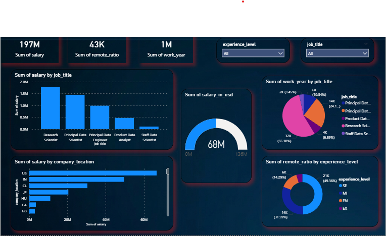

# 🤖 AI Job Data Analysis Dashboard

---

## 📊 Project Overview
The **AI Job Data Analysis Dashboard** is an interactive Power BI report designed to analyze trends in AI-related job roles, salary distribution, remote work patterns, and experience levels. This project provides insights into the evolving AI job market using real-world datasets.

---

## 🎯 Project Objectives
* **Salary Analysis:** Compare salary distribution across different job roles.
* **Remote Work Trends:** Analyze how remote work varies by experience level.
* **Job Market Insights:** Identify high-demand roles in AI/ML.
* **Location Analysis:** Evaluate salary contribution by company location.

---

## 📌 Key Performance Indicators (KPIs)
| Metric | Value |
| :--- | :--- |
| **Total Salary** | **197M** |
| **Remote Ratio** | **43K** |
| **Work Year Records** | **1M** |
| **Salary in USD** | **68M** |

---

## 📈 Analysis & Insights

### 1️⃣ Salary Distribution by Job Role
* **Research Scientist** and **Principal Data Scientist** contribute the highest salaries.
* **Data Engineers** and **Analysts** show steady demand.
* **Insight:** Senior-level roles dominate the salary market.

---

### 2️⃣ Remote Work Trends
* **Mid-level (MI)** and **Senior-level (SE)** roles have the highest remote work ratio.
* **Entry-level (EN)** roles have lower remote opportunities.
* **Insight:** Experience significantly impacts remote work flexibility.

---

### 3️⃣ Job Distribution by Experience Level
* Senior professionals dominate workforce contribution.
* Executive roles have smaller but high-value participation.
* **Insight:** AI industry is highly experience-driven.

---

### 4️⃣ Salary by Company Location
* **United States** leads in salary contribution.
* **India** and other countries show growing participation.
* **Insight:** Global demand for AI talent is increasing.

---

## 🎛 Dashboard Features
* **Interactive Filters:** Filter by Job Title and Experience Level.
* **Dynamic Visualizations:** Includes Bar Charts, Donut Charts, and KPI Cards.
* **Modern UI Design:** Dark-themed dashboard with glowing card effects.

---

## 🚀 Conclusion
The analysis highlights that **senior and principal roles dominate the AI job market**, with higher salaries and more remote opportunities. The **United States leads globally**, while other countries are rapidly growing in AI job demand.

---

## 📸 Dashboard Preview
