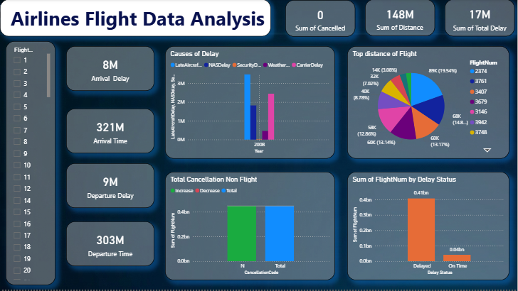

# ✈️ Airlines Flight Data Analysis Dashboard

---

## 📊 Project Overview
The **Airlines Flight Data Analysis Dashboard** provides a deep dive into aviation operational efficiency, specifically focusing on delay patterns and flight logistics. By analyzing high-volume flight data, this dashboard identifies significant bottlenecks in arrival and departure schedules to help optimize airline performance.

---

## 🎯 Project Objectives
* **Operational Monitoring:** Track total flight distances and cumulative delay minutes.
* **Root Cause Identification:** Categorize delays into specific triggers like Weather, Carrier, or NAS issues.
* **Efficiency Mapping:** Analyze the distribution of flight distances across different flight numbers.

---

## 📌 Key Performance Indicators (KPIs)
| Metric | Value |
| :--- | :--- |
| **Sum of Distance** | **148M** |
| **Sum of Total Delay** | **17M** |
| **Arrival Delay** | **8M** |
| **Departure Delay** | **9M** |

---

## 📈 Analysis & Insights

### 1️⃣ Primary Causes of Delay
The **Causes of Delay** breakdown reveals the leading factors affecting schedules:
* **Late Aircraft & NAS Delay:** These represent the most significant contributors to total delay time.
* **Carrier & Weather:** Show lower but consistent impacts on overall operations.
* **Insight:** Internal operational delays (Late Aircraft) and system-wide issues (NAS) outweigh external factors like weather.

### 2️⃣ Flight Status & Volume
Based on the **Delay Status** analysis:
* **Delayed Flights:** Account for a massive volume of **0.41bn** in the dataset.
* **On Time:** Only represents a small fraction (**0.04bn**) of the total flight count shown.

### 3️⃣ Distance Distribution
* **Top Performer:** Flight Num **2374** covers the largest share of distance at **19.54% (89K)**.
* **Flight Spread:** The top 8 flight numbers are relatively evenly distributed, ranging from **3.08% to 14.8%** of the total distance tracked in this segment.

---

## 🎛 Dashboard Features
* **Flight Slicer:** Interactive vertical sidebar to filter the entire dashboard by specific Flight Numbers.
* **Operational Cards:** Quick-glance metrics for Arrival and Departure times vs. Delays.
* **Dark Mode UI:** High-contrast blue and charcoal theme designed for modern data monitoring centers.

---

## 🚀 Conclusion
The dashboard highlights a critical need for addressing **Late Aircraft** and **NAS Delays**, which are the primary drivers behind the **17M minutes** of total delay. With only a small portion of flights currently classified as "On Time," there is a significant opportunity for scheduling optimization.

---

## 📸 Dashboard Preview
