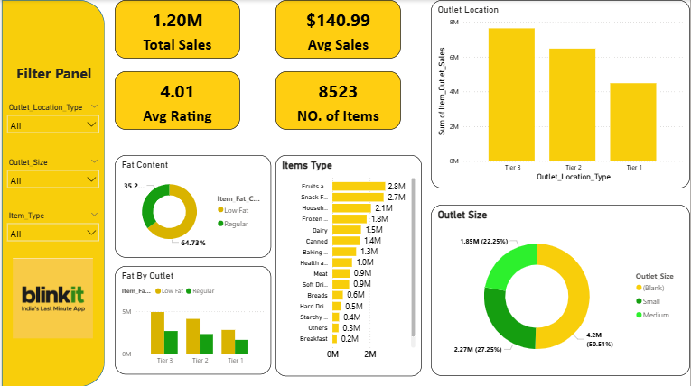

<!-- 🛒 Blinkit Sales Analysis Dashboard – Data Analytics Report
📊 Project Overview
The Blinkit Sales Analysis Dashboard provides a deep dive into the operational and sales performance of "India’s Last Minute App." By visualizing data from over 8,500 items, this report identifies consumer trends, product preferences, and outlet efficiency across various city tiers.

🎯 Objectives
To monitor core financial metrics: Total Sales, Average Sales, and Customer Ratings.

To analyze the impact of Item Fat Content on consumer purchasing behavior.

To compare the performance of different Outlet Sizes (Small, Medium, High).

To visualize sales distribution across Tier 1, Tier 2, and Tier 3 locations.

🛠 Tools & Technologies
Power BI – Visualization and Dashboard design.

Power Query – Data cleaning and ETL processes.

DAX – Custom measures for Sales and Ratings.

UI/UX – Custom "Blinkit Yellow" theme for brand consistency.

📌 Key Performance Indicators (KPIs)
These figures represent the high-level health of the business as shown in your dashboard:

Total Sales: $ 1.20M

Avg Sales: $ 140.99

Avg Rating: 4.01

NO. of Items: 8523

📈 Dashboard Analysis & Insights
1️⃣ Fat Content Distribution
The Fat Content donut chart indicates a clear health-oriented trend:

Low Fat: 64.73%

Regular: 35.27%

Insight: More than half of the inventory sold belongs to the Low Fat category, suggesting that Blinkit customers prioritize healthier options.

2️⃣ Item Type Sales Volume
The Items Type bar chart identifies the highest contributing categories:

Top Categories: Fruits & Vegetables and Snack Foods lead the charts.

Follow-up Categories: Household items and Frozen foods also show strong performance.

Insight: Daily essentials and impulse-buy snacks are the primary drivers of transaction volume.

3️⃣ Outlet Location & Size Analysis
Location Performance: Tier 3 locations show the highest sales volume, followed by Tier 2 and Tier 1.

Size Efficiency: Medium-sized outlets are the dominant contributors, accounting for 50.51% of the total.

Small Outlets: Contribute 27.25%, while High/Blank categories make up the remaining 22.25%.

🎛 Dashboard Filters (Interactive Panel)
The dashboard features a dedicated Filter Panel on the left to slice data by:

Outlet Location Type (Tier 1, 2, 3)

Outlet Size (Small, Medium, High)

Item Type (Dropdown selection)

🚀 Conclusion
The data shows that Medium outlets in Tier 3 locations are the most successful business units for Blinkit. By focusing inventory on Low Fat items within the Fruits, Vegetables, and Snacks categories, the platform can maximize its revenue and meet the specific demands of its largest customer segments -->

# 🛒 Blinkit Sales Analysis Dashboard

## 📊 Project Overview
The **Blinkit Sales Analysis Dashboard** is a comprehensive Power BI report designed to analyze the sales performance, item distribution, and outlet efficiency of Blinkit (India's Last Minute App). By visualizing data from **8,523 items**, this project identifies key growth drivers and consumer preferences across different market segments.

---

## 🎯 Project Objectives
* **Financial Tracking:** Monitor Total Sales, Average Sales, and Ratings.
* **Inventory Analysis:** Evaluate the impact of Fat Content and Item Categories on revenue.
* **Outlet Optimization:** Compare performance across different Outlet Sizes and City Tiers.

---

## 📌 Key Performance Indicators (KPIs)
| Metric | Value |
| :--- | :--- |
| **Total Sales** | **$ 1.20M** |
| **Average Sales** | **$ 140.99** |
| **Average Rating** | **4.01** |
| **Number of Items** | **8523** |

---

## 📈 Analysis & Insights

### 1️⃣ Consumer Health Preferences
The **Fat Content** analysis shows a clear trend:
* **Low Fat:** 64.73% of sales volume.
* **Regular:** 35.27% of sales volume.
* **Insight:** There is a significantly higher demand for Low Fat products among Blinkit users.

### 2️⃣ Top Performing Categories
Based on the **Item Type** analysis:
* **Fruits & Vegetables** and **Snack Foods** are the primary revenue drivers.
* **Household** and **Frozen Foods** also show consistent high performance.

### 3️⃣ Outlet & Location Efficiency
* **Top Location:** **Tier 3** cities lead in total sales volume.
* **Most Efficient Size:** **Medium-sized outlets** account for **50.51%** of total sales activity.
* **Small Outlets:** Contribute **27.25%**, highlighting their importance in high-density areas.

---

## 🎛 Dashboard Features
* **Interactive Filter Panel:** Allows users to slice data by Location, Size, and Item Type.
* **Dynamic Visuals:** Includes Donut Charts, Stacked Bar Charts, and Funnel Visuals for multi-dimensional views.
* **Brand-Themed UI:** Styled with Blinkit’s signature yellow and green color palette for a professional look.

---

## 🚀 Conclusion
The analysis confirms that **Medium outlets in Tier 3 locations** are the most productive segments for the business. By maintaining a high inventory of **Low Fat** items and focusing on **Fresh Produce and Snacks**, Blinkit can continue to drive growth and meet customer demand effectively.

---

## 📸 Dashboard Preview

