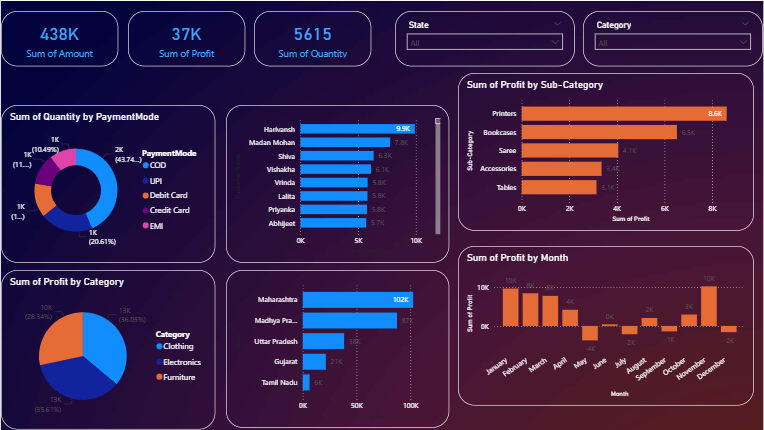

# 📊 E-Commerce Sales Analysis Dashboard
> **An Interactive Data Analytics Project focused on Profit Optimization and Sales Trends.**

---

## 🌟 About the Project
This project analyzes retail performance across multiple regions in India. By merging transaction details with customer order history, I created an end-to-end data pipeline to visualize profitability. The goal was to identify which states, categories, and months contribute most to the bottom line.

---

## 🚀 Key Features & Insights

### 💰 KPI Cards (The "Big Numbers")
* **Total Amount:** Visualizes the total revenue generated across all orders.
* **Total Profit:** Tracks net earnings to monitor business health.
* **Total Quantity:** Shows the volume of items sold.
* **Average Order Value (AOV):** Helps understand the spending power of the average customer.

### 📈 Data Visualizations
* **Profit by Month:** Identifies seasonal peaks (e.g., performance spikes in January and November).
* **Profit by Sub-Category:** A detailed breakdown showing that **Printers, Bookcases, and Accessories** are the highest margin items.
* **Sales by State:** A geographic analysis highlighting **Maharashtra, Madhya Pradesh, and Uttar Pradesh** as the top revenue generators.
* **Category Share (Donut Chart):** Shows the sales distribution between **Clothing (63%), Electronics (21%), and Furniture (16%)**.
* **Top Customer Spending:** A bar chart tracking the highest-value customers like **Harivansh, Madhav, and Madan Mohan**.

### 🎛️ Interactive Slicers
The dashboard is fully dynamic. You can filter all visuals by:
* **State:** Drill down into specific regions.
* **Quarter (Q1-Q4):** See how sales change throughout the financial year.
* **Category:** Focus specifically on Clothing, Electronics, or Furniture.

---

## 🛠️ Technical Workflow
1. **Data Cleaning:** Used **Power Query** to handle null values and format dates in `Orders (1).csv` and `Details.csv`.
2. **Data Modeling:** Created a relationship between the two datasets using the `Order ID` column.
3. **DAX Calculations:** Wrote custom measures to calculate Profit Margins and Average Order Values.
4. **Dashboard Design:** Implemented a user-friendly layout with a dark theme for high-contrast readability.

---

## 🔗 Project Links
Developed with by **Aman Kumar**

---

## 🖼️ Dashboard Preview

Below is the final interactive dashboard representing the complete analysis:

