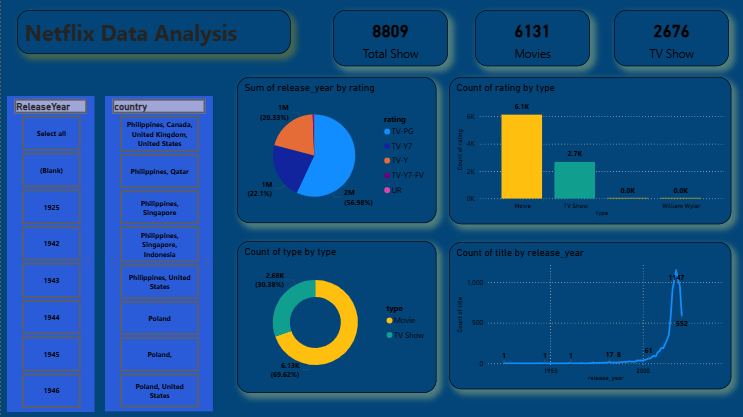

# 🎬 Netflix Content Data Analysis Dashboard

---

## 📊 Project Overview
The **Netflix Data Analysis Dashboard** offers a comprehensive exploration of the global streaming giant's content library. By analyzing a dataset of over **8,800 titles**, this project visualizes the distribution between Movies and TV Shows, content ratings, and production trends over the last century.

---

## 🎯 Project Objectives
* **Content Categorization:** Quantify the split between Movies and TV Shows in the library.
* **Rating Distribution:** Analyze how content is rated (e.g., TV-PG, TV-Y) to understand target audience demographics.
* **Historical Trends:** Track the growth of content releases over time to identify periods of rapid library expansion.

---

## 📌 Key Performance Indicators (KPIs)
| Metric | Value |
| :--- | :--- |
| **Total Shows** | **8,809** |
| **Movies** | **6,131** |
| **TV Shows** | **2,676** |

---

## 📈 Analysis & Insights

### 1️⃣ Content Type Distribution
The library is heavily weighted towards feature-length films:
* **Movies:** Comprise **69.62% (6.13K)** of the total library.
* **TV Shows:** Account for **30.38% (2.68K)** of the platform's offerings.

### 2️⃣ Content Ratings Breakdown
The **Sum of release_year by rating** and **Count of rating by type** charts reveal:
* **TV-PG** is a major rating category, representing **56.98% (2M sum of years)** of the data analyzed.
* **TV-Y** and **TV-Y7** follow as the next most significant categories at **22.1%** and **20.33%** respectively.
* **Movie vs. TV Show Ratings:** Movies significantly outnumber TV shows across almost all rating tiers, as shown in the bar chart comparison (**6.1K vs 2.7K**).

### 3️⃣ Release Year Trends
The **Count of title by release_year** line graph shows a dramatic exponential growth:
* **Early History:** Content counts remained flat and near zero from 1925 through the mid-20th century.
* **Modern Boom:** A sharp surge begins around the year 2000, peaking at **1,147 releases** in a single recent year before showing a slight tail-off in the most recent data points.

---

## 🎛 Dashboard Features
* **Global Filters:** Sidebar slicers for **Release Year** (dating back to 1925) and **Country** of origin.
* **Categorical Slicers:** Ability to drill down into specific production regions like **Philippines, Canada, Poland,** and the **United States**.
* **Modern Dark UI:** A sleek blue and charcoal aesthetic consistent with modern streaming interface designs.

---

## 🚀 Conclusion
The data highlights Netflix's transition from a legacy content aggregator to a modern production powerhouse. While **Movies** still dominate the library in terms of sheer volume, the explosive growth in releases post-2000 indicates a massive investment in rapid content acquisition and original production to satisfy global demand.

---

## 📸 Dashboard Preview
