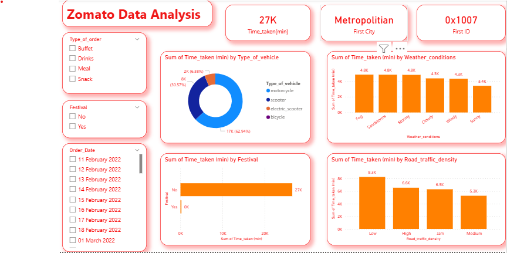

# 🛵 Zomato Delivery Performance Dashboard

---

## 📊 Project Overview
The **Zomato Data Analysis Dashboard** provides an in-depth look at food delivery logistics. By analyzing over **27,000 minutes** of delivery data, this report highlights how various environmental and operational factors—such as weather conditions, traffic density, and vehicle choice—impact the speed of service in metropolitan areas.

---

## 🎯 Project Objectives
* **Delivery Efficiency:** Monitor the total time taken for orders across different categories.
* **Fleet Breakdown:** Evaluate the contribution of different vehicle types to the total delivery volume.
* **Environmental Analysis:** Measure the impact of external factors like weather and traffic on delivery times.

---

## 📌 Key Performance Indicators (KPIs)
| Metric | Value |
| :--- | :--- |
| **Total Time Taken** | **27K Minutes** |
| **Primary City** | **Metropolitan** |
| **First ID** | **0x1007** |

---

## 📈 Analysis & Insights

### 1️⃣ Delivery Vehicle Distribution
The **Type of Vehicle** donut chart shows:
* **Motorcycle:** The primary delivery vehicle, accounting for **62.94% (17K mins)**.
* **Scooter:** Handles **30.57% (8K mins)** of the delivery time.
* **Electric Scooter:** Represents **6.38% (2K mins)** of the total time.

### 2️⃣ Environmental & Traffic Impacts
* **Weather Conditions:** **Fog, Sandstorms, and Stormy** weather lead the charts as the most time-consuming conditions, each accounting for approximately **4.8K minutes**.
* **Traffic Density:** Interestingly, **Low Traffic** conditions show the highest sum of time taken (**8.3K mins**), suggesting a higher volume of orders during these periods compared to High or Jam conditions.
* **Festival Activity:** Delivery activity is heavily concentrated during non-festival days (**27K mins**) compared to negligible time recorded during festivals.

### 3️⃣ Temporal Analysis
* The data focuses on a specific window from **11 February 2022 to 01 March 2022**, tracking daily performance variations.

---

## 🎛 Dashboard Features
* **Granular Filtering:** Users can slice data by **Order Type** (Buffet, Drinks, Meal, Snack) and **Festival** status.
* **Date Slicer:** Allows for specific day-to-day performance tracking.
* **Thematic Design:** Styled with Zomato's signature red and white palette for brand consistency.

---

## 🚀 Conclusion
The analysis indicates that the **Motorcycle** fleet is the backbone of the delivery operation. While weather conditions like **Fog** and **Storms** predictably increase delivery times, the high volume of delivery minutes during **Low Traffic** suggests that order volume peaks when roads are clear, presenting an opportunity for even faster delivery windows.

---

## 📸 Dashboard Preview
